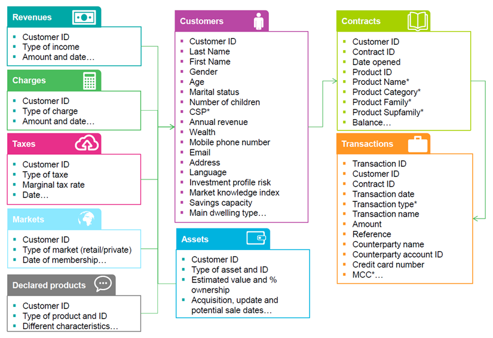

<h1 align="center">
  Welcome to BNP Paribas HACKMIT Guide
   
   <a href="https://group.bnpparibas/en/"> &nbsp &nbsp </a>
   
</h1>

What are the tools we offer
---------------------------

There are two independant tools available through the Open Bank Project API:

* Banking API -  a banking environment for you to simulate transactions between banks, customer-to-bank interactions or even financial actions.
  Here is a list of the objects you can manipulate:
    * Bank
    * Consumer
    * Account
    * ATM
    * Branch
    * Bank Product
    * Card
    * Couterparty
    * Customer
    * Transaction

* Data Warehouse: A huge _elasticsearch_ database composed of __56 000 000 entries on real customers__. Here is the type of data you can access:

<h1 align="center">
   
  
   
</h1>

Here is the list of index of the elastic search database:

Here is the list of index of the elastic search DB:
     
* irb-declared-products, irb-sme-transactions, irb-transactions, irb-contracts, irb-taxes, irb-charges, irb-revenues, irb-individual-clients, irb-markets, irb-sme-client, irb-assets, irb-sme-contracts

* bow-declared-products, bow-sme-transactions, bow-transactions, bow-contracts, bow-taxes, bow-charges, bow-revenues, bow-

* individual-clients, bow-markets, bow-sme-client, bow-assets, bow-sme-contracts

* 20170608-markets, 20170608-taxes, 20170608-charges

__Warning__ - Please note that the two tools are independant. An idea of subject could be to feed the banking environment with the data base to create an App.

Sign In 
---------------

Follow these two steps to have access to our API:

* Register on https://bnpparibas-irb.openbankproject.com/
* Sign our terms and conditions for data usage

Documentation 
--------------

You should find everything you need on these pages:

 * https://bnpparibas-irb-explorer.openbankproject.com/ - The complete documentation of the API.
 *   https://github.com/OpenBankProject/OBP-API/wiki/BNP-Paribas-IRB-OBP-API-Sandbox - The wiki gives you good example of elastic search query. It also provides users logins with dummy data to get familiar with the Bank Simulator.

Available Code
--------------

A small notebook if you want to access the data sandbox through a python SDK

